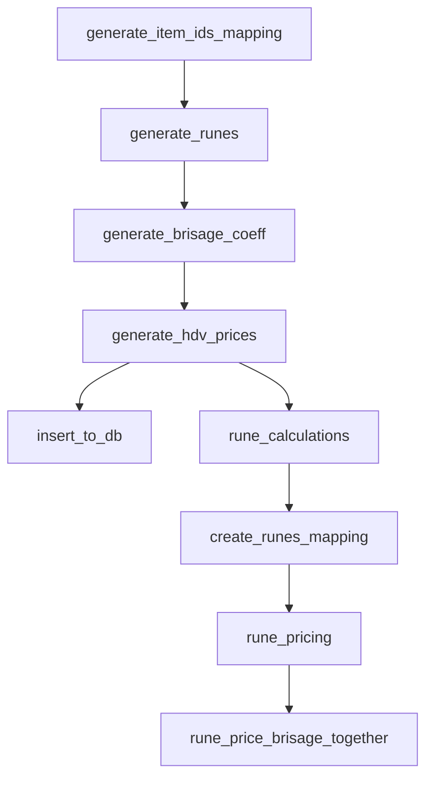

# Dofus Market Price Retrieval and Optimization Project

## Project Overview

This project is designed to automate the retrieval of market prices for all items in the game Dofus. It aims to gather the prices for runes and propose the most efficient methods to earn money in the game by analyzing these prices. The project uses web scraping and data processing techniques to collect and transform data from various sources. Data can be visualized here : https://richus.streamlit.app/

## Project Structure

The project is structured using the following tools and dependencies:

- **Poetry**: A dependency management tool.
- **Selenium**: Used for web scraping.
- **pandas**: For data manipulation and analysis.
- **BeautifulSoup** and **lxml**: For parsing HTML content.
- **requests**: For making HTTP requests.
- **Dagster**: For orchestrating the data pipelines.
- **SQLAlchemy** and **psycopg2-binary**: For database interactions.
- **Streamlit**: For creating interactive web applications.

## Project Components

### 1. Initial Setup

- **`generate_item_ids_mapping`**: Fetches item IDs and names from DofusDB and saves them to a CSV file.
- **`generate_runes`**: Generates the required runes for each item ID based on the item IDs mapping.

### 2. Daily Data Retrieval

- **`generate_brisage_coeff`**: Fetches brisage coefficients from Brifus.
- **`generate_hdv_prices`**: Parses HTML from Vulbis.com to generate a CSV with all market prices.
- **`insert_to_db`**: Inserts the retrieved data into the database.

### 3. Data Transformation

- **`rune_calculations`**: Performs calculations based on the rune data.
- **`create_runes_mapping`**: Creates a mapping of runes.
- **`rune_pricing`**: Calculates prices for runes.
- **`rune_price_brisage_together`**: Combines rune prices and brisage coefficients.

## Dagster Integration

Dagster is used to manage and orchestrate the various tasks and data pipelines. The project defines assets and jobs using Dagster to ensure that all components are run in the correct order and that dependencies are handled properly.

### Assets

- **Initialisation Group**: Includes `generate_item_ids_mapping` and `generate_runes`.
- **Daily Update Group**: Includes `generate_brisage_coeff`, `generate_hdv_prices`, `create_runes_mapping`, `insert_to_db`, `rune_calculations`, `rune_pricing`, and `rune_price_brisage_together`.

### Jobs

- **`main_job`**: Runs the initial setup and all data retrieval and transformation tasks.
- **`daily_job`**: Focuses on the daily update tasks.

### Schedules

- **`daily_schedule`**: Runs the `daily_job` every day at midnight.

## How to Use

1. **Initial Setup**: Run `main_job` to set up the initial data and mappings.
2. **Daily Updates**: Ensure the `daily_schedule` is running to keep the data up-to-date.
3. **Data Analysis**: Use the transformed data to analyze market prices and determine the most efficient ways to earn money in Dofus.

## Asset Connections

Below is a schema representing the connections between the Dagster assets in the project. The arrows indicate dependencies, showing the flow of data from one asset to another.

By following this structure and using the provided assets and jobs, you can automate the retrieval and processing of Dofus market prices, ensuring that you always have up-to-date data to make informed decisions on the most efficient ways to earn money in the game.
